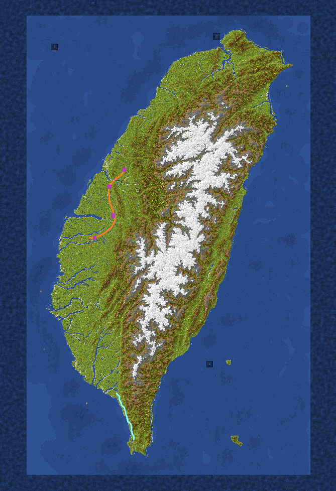

# 第8季 台灣地圖伺服器NTMS 

### 版本： 1.21
### 插件版本：v8.0.0
### 目前進度：尚未開服，預計於六月下旬或七月上旬開始遊玩
在新一季台灣地圖中，將會繼承之前台灣地圖的許多功能，並且額外新增更多功能，致力於讓遊戲的遊玩體驗更加完整，整體方向往RPG類型地圖前進，讓我們在台灣地圖伺服器內和朋友們一起玩吧！

***
#### 新一季台灣會有：
 - [x] 更強的怪物
 - [x] 多種職業
 - [x] 更多的裝備與武器
 - [x] 貨幣系統
 - [ ] 隨機活動
 - [x] 時間與日期系統
 - [x] 更多合成材料

***
### 目前縣市人數(4/15)

 - [x] 台北
 - [ ] 桃園
 - [ ] 新竹
 - [ ] 苗栗
 - [x] 台中
 - [x] 彰化
 - [ ] 南投
 - [x] 雲林
 - [ ] 嘉義
 - [ ] 台南
 - [ ] 高雄
 - [x] 屏東
 - [ ] 台東
 - [ ] 花蓮
 - [ ] 宜蘭

***
## 台灣地圖(4/7下注活動後新增鐵路與公路)
#### 青色為公路；橘色為鐵路；紫色點為火車站。

