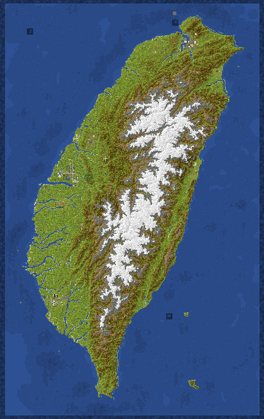

# 第8季 台灣地圖伺服器NTMS 

### 版本： 1.21.4
### 插件版本：v8.4.1
### 目前進度：113/7/3開服至今遊玩中
在新一季台灣地圖中，將會繼承之前台灣地圖的許多功能，並且額外新增更多功能，目標讓遊戲的遊玩原版生存體驗更加完整，整體方向往RPG類型地圖前進，讓我們在台灣地圖伺服器內和朋友們一起玩吧！
***
#### 外部引用插件：
 - Residence
 - CMILib
 - EssentialsX
 - HoloMobHealth
 - Vault
 - GroupManager
 - ProtocolLib
 - QuickShop

***
#### 新一季台灣有：
 - [x] 更強的怪物：突襲強化，劫毀獸、幻術師...
 - [x] 多種職業：Terminator、Explosion
 - [x] 更多的裝備與武器：青金石裝備
 - [x] 貨幣系統
 - [ ] 隨機活動
 - [x] 時間與日期系統：右邊記分板
 - [x] 更多合成材料：碎玉核心、附魔紅石、精製的青金石
 - [ ] 副本系統

***
### 目前縣市人數(13/15)

 - [x] 台北 (+基隆)
 - [x] 桃園
 - [ ] 新竹
 - [ ] 苗栗
 - [x] 台中
 - [x] 彰化
 - [x] 南投
 - [x] 雲林
 - [x] 嘉義
 - [x] 台南
 - [x] 高雄
 - [x] 屏東
 - [x] 台東
 - [x] 花蓮
 - [x] 宜蘭

***
## 台灣地圖(4/7下注活動後新增鐵路與公路)
#### 青色為公路；橘色為鐵路；紫色點為火車站。

---

